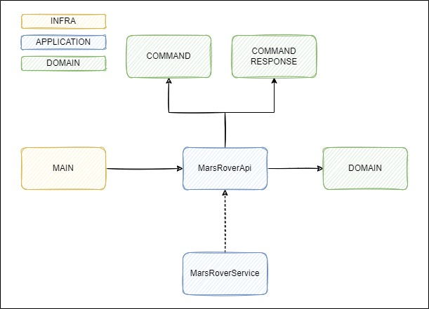

# MARS ROVER SKELETON (for Kotlin Padawans)

Just a Mars Rover Kata Skeleton for the well known Mars Rover exercise.

You can follow the instructions in any of the exercises published in internet

[Mars Rover Kata - Codurance Katalyst](https://katalyst.codurance.com/mars-rover)

[Mars Rover kata - kata-log.rocks](https://kata-log.rocks/mars-rover-kata)

## Rules

The only rule is to not modify the interface present in the code MarsRoverApi.

## Simple diagram of the skeleton

### Disclaimer

This is just for learning purposes, there are some incorrect approaches that are explicitly there for the aim of
learning some specific concepts before moving to a more advanced topics